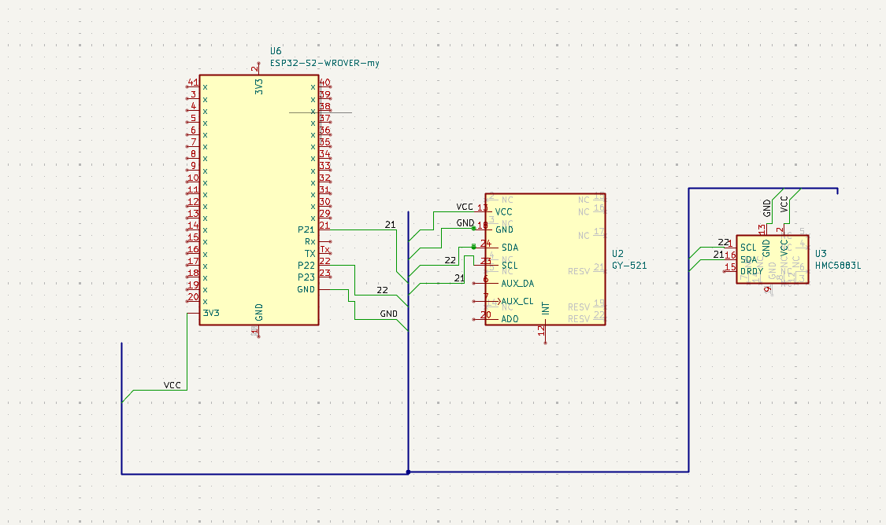

Com certeza! Vou consolidar o **README** e a análise de utilização em um único arquivo `.md` (Markdown), ideal para repositórios de código.

---

# `README.md`: Sistema de Sensores em Tempo Real (RM/DS) no ESP32

## 🎯 Visão Geral

Este projeto implementa um sistema embarcado de tempo real usando **FreeRTOS** em um **ESP32**. O objetivo é coletar dados de sensores (GY521 e QMC5883L) e atender a requisições de rede (GET via WiFi AP) com garantias de tempo.

O escalonamento utiliza o **Rate Monotonic (RM)** para tarefas periódicas de sensor e o modelo **Deferrable Server (DS)** para a tarefa aperiódica de rede, garantindo previsibilidade e baixo atraso de serviço. O código também implementa medições de **WCET** e **Jitter** para validação empírica.

---

## ⚙️ Arquitetura e Configuração

### 1. Tarefas Periódicas (Rate Monotonic - RM)

As tarefas de leitura de sensor são escalonadas por **Prioridade Fixa (RM)**, onde o menor período recebe a maior prioridade. Todas executam no `PRO_CPU_NUM`.

| Tarefa | Função | Período ($T_i$) | Prioridade FreeRTOS |
| :---: | :---: | :---: | :---: |
| **`taskGyro`** | Eixos de ângulo (AX, AY, AZ) | $500 \, \text{ms}$ | 3 (Mais Alta) |
| **`taskIMU`** | Atitude (Pitch, Roll, Yaw) | $1000 \, \text{ms}$ | 2 |
| **`taskMag`** | Eixos Magnéticos (X, Y, Z) | $2000 \, \text{ms}$ | 1 (Mais Baixa) |

### 2. Tarefa Aperiódica (Deferrable Server - DS)

A tarefa de rede é modelada como um **Deferrable Server** para atendimento rápido de requisições **"GET"** sem comprometer a escalabilidade do sistema.

| Tarefa | Função | Orçamento ($C_s$) | Período ($T_s$) | Prioridade FreeRTOS |
| :---: | :---: | :---: | :---: | :---: |
| **`taskServer`** | Processamento de GET e envio de dados | $14 \, \text{ms}$ | $40 \, \text{ms}$ | 4 (Preempta Sensores) |

---

## 📈 Análise de Utilização e Escalabilidade

O sistema é analisado usando o teste de escalabilidade para o modelo Deferrable Server (DS) de tarefas periódicas + um servidor aperiódico.

### A. Cálculo da Utilização do Servidor ($U_s$)

A utilização do servidor é definida pela relação entre seu Orçamento ($C_s$) e seu Período de Recarga ($T_s$):

$$U_s = \frac{C_s}{T_s} = \frac{14 \, \text{ms}}{40 \, \text{ms}} = \mathbf{0.35} \quad (\mathbf{35\%})$$

### B. Cálculo do Limite de Utilização (Bound - $U_{\text{limite}}$)

O limite de utilização ($\mathbf{U_{\text{limite}}}$) para as $n=3$ tarefas periódicas com um DS de $U_s=0.35$ é calculado pela fórmula:

$$U_{\text{limite}} = n \left(K^{1/n} - 1\right) \quad \text{onde} \quad K = \frac{U_s + 2}{2U_s + 1}$$

1.  **Cálculo de $K$:**
    $$K = \frac{0.35 + 2}{2(0.35) + 1} = \frac{2.35}{1.7} \approx 1.38235$$

2.  **Cálculo de $U_{\text{limite}}$:**
    $$U_{\text{limite}} \approx 3 \left((1.38235)^{1/3} - 1\right) \approx 3 (1.1141 - 1) \approx \mathbf{0.3423}$$

O limite de utilização teórica ($\mathbf{U_{b}}$) para as tarefas periódicas é de **$34.23\%$**.

### C. Conclusão da Escalabilidade

A **Utilização Periódica Real ($U_p^{\text{real}}$)** (calculada com os WCETs medidos) é dada por:

$$U_p^{\text{real}} = \frac{\mathbf{WCET\_GYRO}}{500000} + \frac{\mathbf{WCET\_IMU}}{1000000} + \frac{\mathbf{WCET\_MAG}}{2000000}$$

Como o WCET de leituras I2C é tipicamente muito baixo (na ordem de centenas de $\mu\text{s}$), a utilização $U_p^{\text{real}}$ será $\ll 1\%$.

**Resultado:** O sistema é **escalonável**. O requisito de $U_p^{\text{real}} \le 34.23\%$ é facilmente atendido. O sistema opera com uma grande folga, garantindo que mesmo os atrasos introduzidos pela preempção do servidor ($C_s = 14 \, \text{ms}$) não farão com que as tarefas periódicas percam seus prazos.

---

## 🔬 Métricas em Tempo Real (WCET e Jitter)

O código captura as seguintes métricas (em $\mu\text{s}$) e as imprime no `loop()` para validação:

| Métrica | Descrição | Variáveis Monitoradas |
| :---: | :---: | :---: |
| **WCET ($C_i$)** | **Pior Caso de Tempo de Execução**. Indica o $C_i$ mais alto observado para a seção crítica (I2C + empacotamento) ou para o serviço de rede. | `wcet_mag`, `wcet_imu`, `wcet_gyro`, `wcet_server` |
| **Jitter** | **Máximo Desvio de Ativação**. O desvio absoluto máximo observado entre o período nominal ($T_i$) e o tempo real entre as ativações da tarefa. | `jitter_mag`, `jitter_imu`, `jitter_gyro` |

### ⚠️ Avaliação do WCET do Servidor

Se o `wcet_server` medido exceder o orçamento alocado ($14000 \, \mu\text{s}$), o serviço está estourando o *budget*, e o parâmetro $C_s$ deve ser aumentado ou a lógica de serviço simplificada para manter a validade da garantia de tempo.

---

## 🌐 Conexão e Uso

1.  **Upload:** Faça o upload do código no ESP32.
2.  **WiFi:** O ESP32 iniciará um Ponto de Acesso (AP):
    * **SSID:** `ESP32_AP_RM`
    * **Senha:** `12345678`
3.  **IP:** O IP do AP é geralmente `192.168.4.1`.
4.  **Cliente:** Conecte um cliente (e.g., Python, navegador) ao IP e porta `5005`.
5.  **Requisição:** Envie o comando **`GET\n`** via socket TCP.
6.  **Resposta:** O servidor (DS) será acionado para drenar a fila de sensores e retornar os dados (no formato `TAG:v1,v2,v3|TAG:v1,v2,v3|...`).
7.  **Monitor Serial:** Monitore as métricas de WCET e Jitter, que são atualizadas a cada 5 segundos.

## Esquematica do projeto 

A esquematica foi desenhada no software kicad e alguns dos componetes foram adaptados para o modelo usado no projeto

